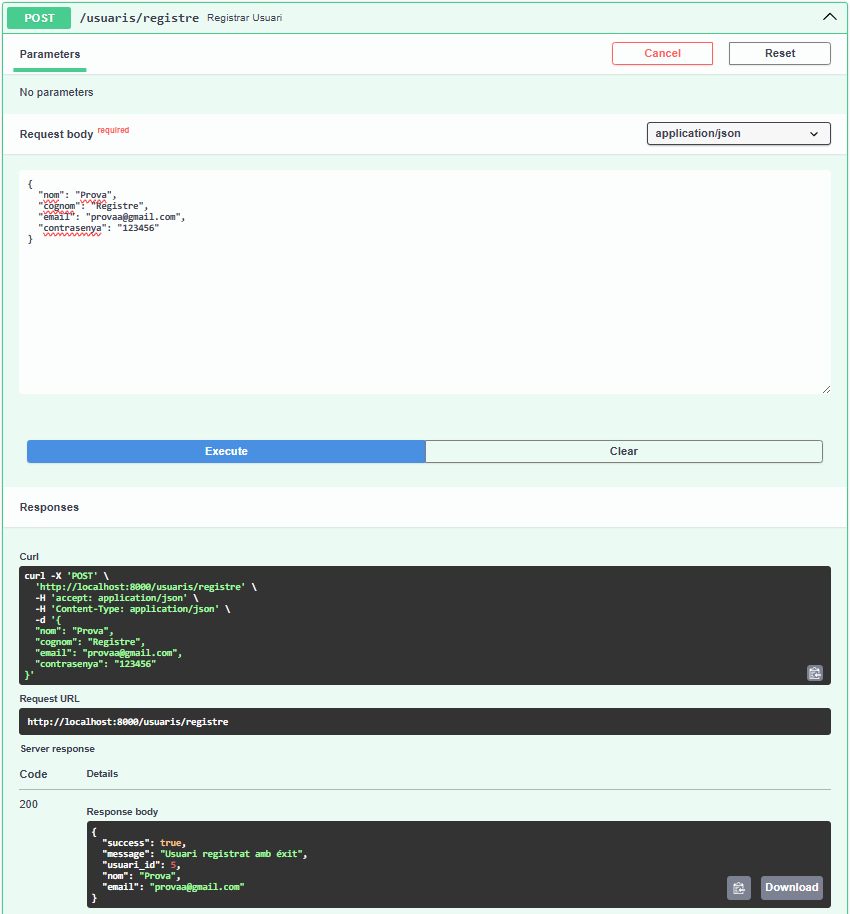

# API_Ecosense
## API per l'aplicació mòbil
## Fet per Karolayn Muñoz

### Endpoints de l'API
L’API proporciona els següents endpoints:

- GET /

Aquest es per saber ja de principi el funcionament d'un endpoint de prova.

- GET /usuaris/

Aquest endpoint mostra tos els usuaris que hi ha a la base de dades. En aquest cas no es mostra la contrasenya ja que està hasheada a la base de dades.

- GET /usuaris/{usuari_id}

Aquest endpoint mostra només l'usuari que es troba per l'id que es passa com a paràmetre.

- POST /usuaris/login

Aquest és un endpoint d'ajuda per tal de processar un login més segur, llavors se l'ha de passar tota la informació, i si coincideixen é´s perquè existeix i es pot fer un inici de sessió. Torna missatge de SUCCESS = TRUE.

- POST /usuaris/registre

Aquest endpoint crea un nou usuari i l'insereix a la base de dades, si tot és correcte mostra missatge de SUCCESS = TRUE.

- GET /sensors/

Aquest endpoint mostra tots els sensors i el seu estat dins de la base de dades.

- GET /sensors/{sensor_id}

Aquest endpoint mostra només el sensor que es va demanar pel seu id.

- PUT /sensors/{sensor_id}

Abans de la modificació:

Després de la modificació: 

- DELETE /sensors/{sensor_id}

Abans d'eliminar:

Després d'eliminar:

- GET /lectures/

En aquest endpoint només és obligatori inserir l'id del sensor, pero les dades són opcionals ja que la informació apareix per id. Mostra les dades de les lectures de l'humetat del sensor.

- GET /humitat/{sensor_id}

Aquest endpoint només mostra el valor de la humitat d'un sensor en especific. Es va afegir per fer el procés de recollida de dades essencials més ràpid i efectiu.

- GET /plantes/

Aquest endpoint mostra totes les plantes que hi ha a la base de dades.

- POST /plantes/

En aquest enpoint s'afegeix una planta a la base de dades, és obligatori inserir id d'usuari i sensor que ja existeixen, o s'han de crear per afegir-los.

- GET /plantes/por-zones

Aquest endpoint és similar al de mostrar totes les plantes, però aquest les mostra agrupades per zones, és a dir, surten en conjunt per la seva ubicació.

Aquest és un endpoint pensat especificament per poder mostrar les plantes per usuari filtrades per zones a l'aplicació mòbil.

- GET /plantes/{planta_id}

Aquest endpoint mostra totes les dades d'una planta per el seu id.

- PUT /plantes/{planta_id}

En aquest endpoint es pot modificar les dades d'una planta pel seu id.

- DELETE /plantes/{planta_id}

Aquest endpoint elimina una planta per el seu id, si s'elimina correctament torna un missatge de confirmació.

- GET /plantes/complet/{planta_id}

Aquest endpoint retorna tota la informació relacionada a una planta, és a dir, no només els camps de la taula planta si no que també el seu sensor, la seva humitat que son d'altre taules diferents.

A més, es van fer Schemas per a cada necessitat, estàn personalitzats per tal de poder mostrar i tornar només la informació que es desea a l'endpoint. Això es va fer per tal de fer mmillorar i que sigui més ràpida l'obtenció de dades.

